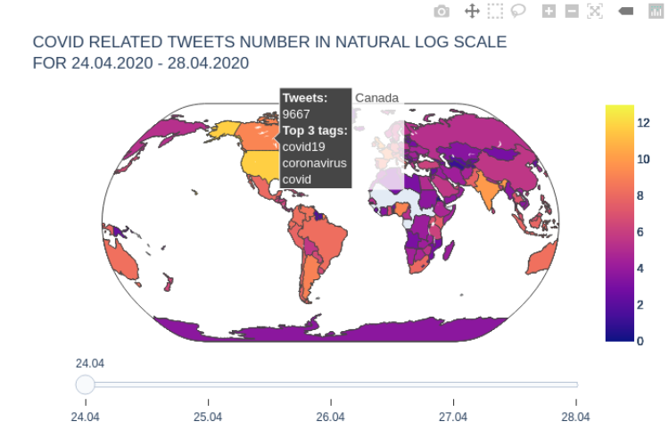

# sma-covid-tweets-map

This project is an assigment for Social Media Analysis course at Wroclaw Univ. of Science and Technology.

### Project goal
An interactive map, presenting usage of covid related hashtags based on Twitter data from [this site](https://zenodo.org/record/4477768#.YCz23XVKhhE).

### Knowledge and skills scope
* Docker
* Jupyter IPython Notebooks
* Python:  
    * data organization: Pandas, GeoPandas
    * visualization: Plotly, Folium

### Outcome
An interactive map is available [here](https://kornelro.github.io/sma-covid-tweets-map/).
